## Problem Statement:
In this project, initially you need to preprocess the data and then develop an
understanding of the different features of the data by performing exploratory
analysis and creating visualizations. Further, after having sufficient knowledge
about the attributes, you will perform a predictive task of classification to predict
whether an individual makes over 50,000 a year or less by using different
machine learning algorithms.

---

## Project Objective:
The goal of this machine learning project is to predict whether a person makes over 50K a year or not given their demographic variation. To achieve this, several classification techniques are explored and the random forest model yields to the best prediction result.

---

## Data Description
1. **Categorical Attributes**

  - ***Workclass***: Private, Self-emp-not-inc, Self-emp-inc, Federal-gov, Local-gov, State-gov, Without-pay, Never-worked.
Individual work category
  - ***Education***: Bachelors, Some-college, 11th, HS-grad, Prof-school, Assoc-acdm, Assoc-voc, 9th, 7th-8th, 12th, Masters, 1st-4th, 10th, Doctorate, 5th-6th, Preschool.
Individual's highest education degree
  - ***Marital-status***: Married-civ-spouse, Divorced, Never-married, Separated, Widowed, Married-spouse-absent, Married-AF-spouse.
Individual marital status
  - ***Occupation***: Tech-support, Craft-repair, Other-service, Sales, Exec-managerial, Prof-specialty, Handlers-cleaners, Machine-op-inspct, Adm-clerical, Farming-fishing, Transport-moving, Priv-house-serv, Protective-serv, Armed-Forces. Individual's occupation
  - ***Relationship***: Wife, Own-child, Husband, Not-in-family, Other-relative, Unmarried. Individual's relation in a family
  - ***Race***: White, Asian-Pac-Islander, Amer-Indian-Eskimo, Other, Black. Race of Individual
  - ***Sex***: Female, Male.
  - ***Native-country***: United-States, Cambodia, England, Puerto-Rico, Canada, Germany, Outlying-US(Guam-USVI-etc), India, Japan, Greece, South, China, Cuba, Iran, Honduras, Philippines, Italy, Poland, Jamaica, Vietnam, Mexico, Portugal, Ireland, France, Dominican-Republic, Laos, Ecuador, Taiwan, Haiti, Columbia, Hungary, Guatemala, Nicaragua, Scotland, Thailand, Yugoslavia, El-Salvador, Trinadad&Tobago, Peru, Hong, Holand-Netherlands. Individuals Native Country

2. **Continuous Attributes**

  - ***Age***: continuous, age of an individual
  - ***Fnlwgt***: final weight, continuous, 
The weights on the CPS files are controlled to independent estimates of the civilian noninstitutional population of the US. These are prepared monthly for us by Population Division here at the Census Bureau.
  - ***Capital-gain***: continuous.
  - ***Capital-loss***: continuous.
  - ***Hours-per-week***: continuous, individual's working hour per week

---

## Data Pre-processing Steps
The pre-processing of the data included the following steps:
1. Step 1: Load Data
2. Step 2: Perform ***Exploratory Data Analysis***
    - Confirm number of records in the data and how they are distributed
    - Check data types
    - Check for missing data, invalid entries, duplicates
    - Examine the correlation and multicolinearity betwen independent features with the target (Income) variables.
    - Check for outliers that are known to distort predictions.
3. Step 3: See relations between independent and dependent variables and make inferences.
4. Step 4: Model Predictions for classification,  approaches:
    - Logistic Regression Model.
    - KNeighbors Classifier Model.
    - DecisionTree Classifier Model.
    - GaussianNB Model.
    - RandomForestClassifier Model
5. Step 5: Compare the different algorithm models.
6. Step 6: Choose the best model and predict results.

--- 

## Data Visualization And Insights
### Bivariate Analysis
#### 1. Relationships Of Continuous variables with Target variable:-
  1. **Age**:
        - Hypothesis Test:-
            - *Null Hypothesis* :- there is no difference in Mean age of income group >50k and income group <=50k.
            - *Alternate Hypothesis* :- there is difference in Mean age of income group >50k and income group <=50k.
  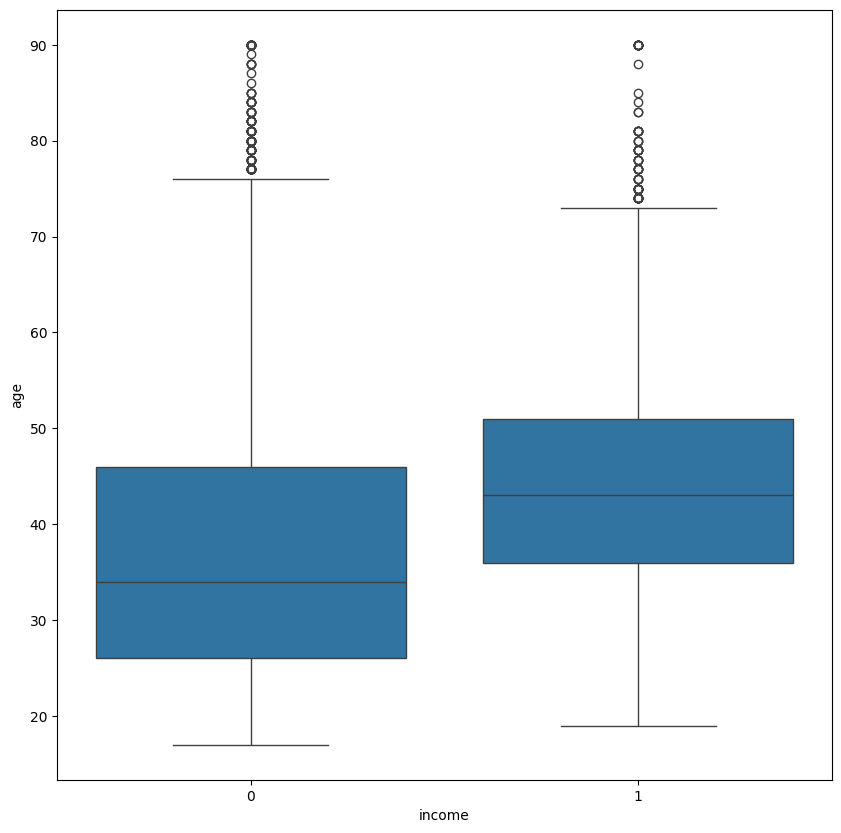
  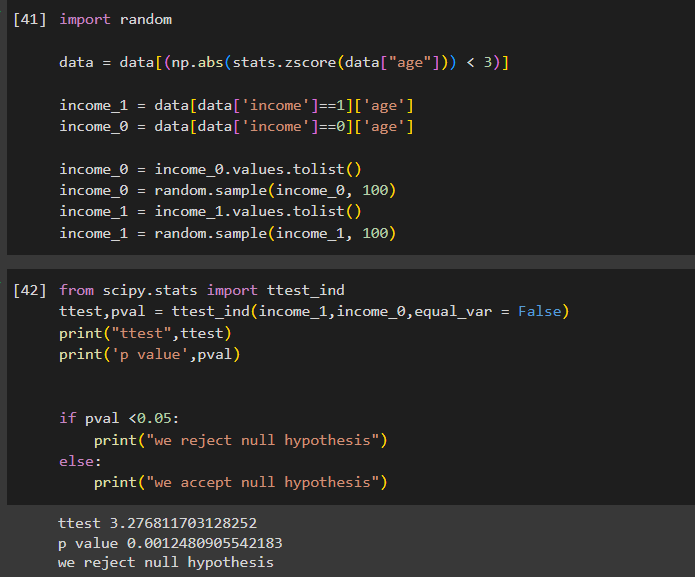
            - *Using Statistical Analysis*:- We can conclude that there is a significant difference in the mean ages of income group >50k and income group <=50k.
It means that age has some contribution to the distinguish income groups.
  2. **Hours per week**:
       - Hypothesis Test:-
            - *Null Hypothesis* :- there is no difference in Mean Hours per Week of income group >50k and income group <=50k.
            - *Alternate Hypothesis* :- there is difference in Mean Hours per Week of income group >50k and income group <=50k. 
   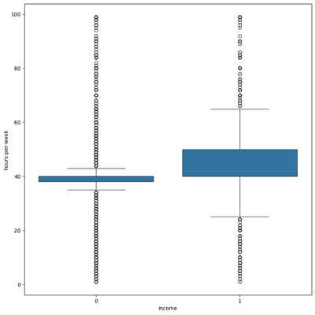
   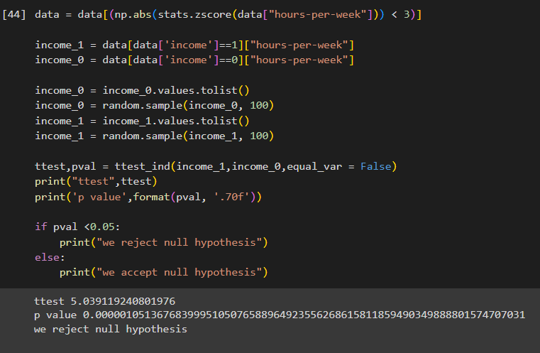
            - *Using Statistical Analysis*:- We can conclude that there is difference in Mean Hours per week of income group >50k and income group <=50k.
It means that hours-per-week has some contribution to the distinguish income groups.
  3. **fnlwgt**:
       - Hypothesis Test:-
            - *Null Hypothesis* :- there is no difference in Mean fnlwgt of income group >50k and income group <=50k.
            - *Alternate Hypothesis* :- there is difference in Mean fnlwgt of income group >50k and income group <=50
   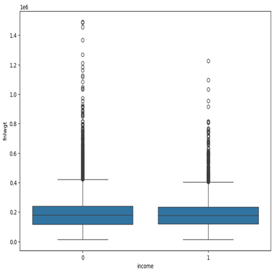
   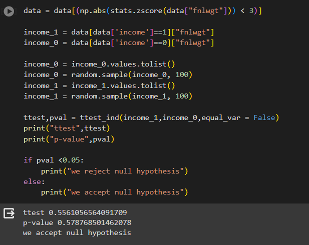
            - *Using Statistical Analysis*:- We can conclude that there is no difference in Mean fnlwgt of income group >50k and income group <=50k.
It means that final weight has no contribution to the distinguish income group.
   4. **Capital-gain**:
        - Hypothesis Test:-
            - *Null Hypothesis* :- there is no difference in Mean Capital gain of income group >50k and income group <=50k.
            - *Alternate Hypothesis* :- there is difference in Mean Capital gain of income group >50k and income group <=50
   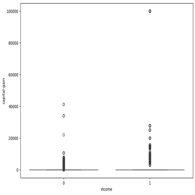
   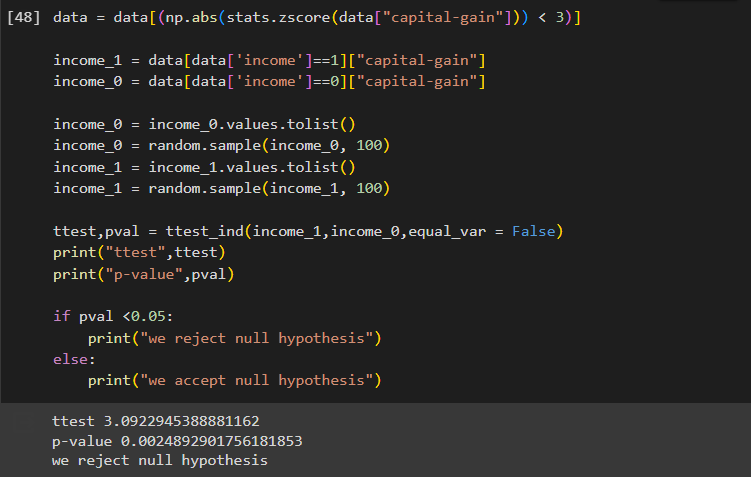 
            - *Using Statistical Analysis*:- We can conclude that there is difference in Mean Capital-gain of income group >50k and income group <=50k.
   5. **Capital-loss**:
         - Hypothesis Test:-
            - *Null Hypothesis* :- there is no difference in Mean Capital loss of income group >50k and income group <=50k.
            - *Alternate Hypothesis* :- there is difference in Mean Capital loss of income group >50k and income group <=50
   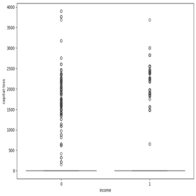
   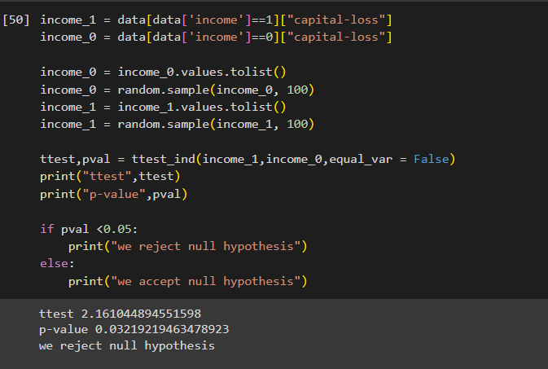
            - *Using Statistical Analysis*:- We can conclude that there is no difference in Mean capital Loss of income group >50k and income group <=50k.
It means that capital-loss is unable to seperate the income groups.
#### 2. Relationships of categorical variables with Target variable:-
  1. **Work Class**:
       - Hypothesis Test:-
            - *Null Hypothesis* :- There is no relationship between workclass and income.
            - *Alternate Hypothesis* :- There is a relationship between workclass and income.
   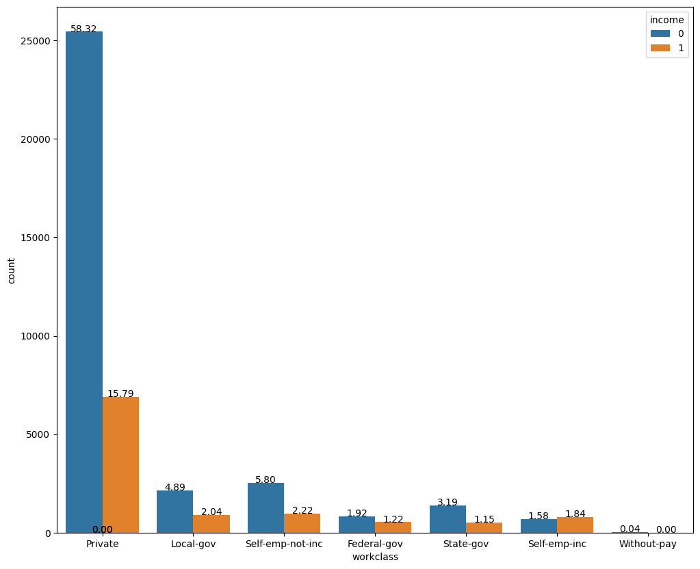
   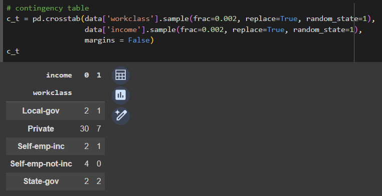
   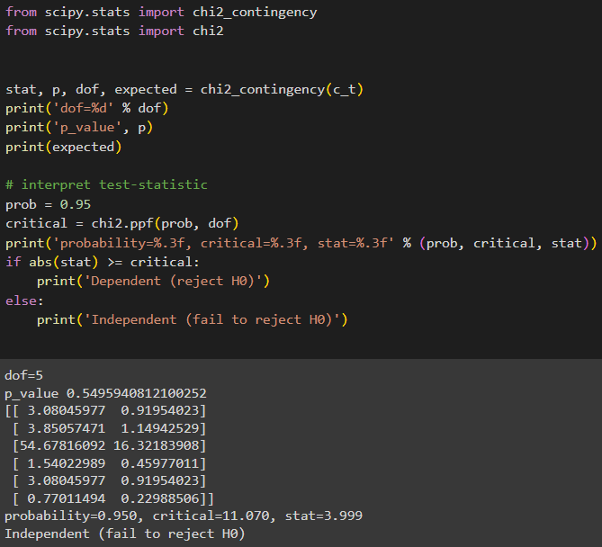
            - *Using Statistical Analysis*:- As we have accept the H0, that there is no relationship between these two categorical variable.
We can conclude that is no dependency of "workclass" attribute on the target variable "income.
  2. **Education**
       - Hypothesis Test:-
            - *Null Hypothesis* :- There is no relationship between Education and income.
            - *Alternate Hypothesis* :- There is a relationship between Education and income.
  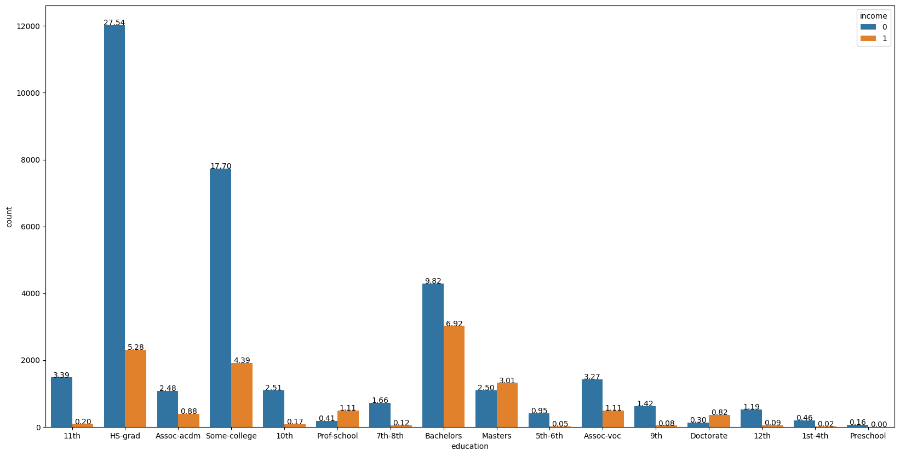
  
  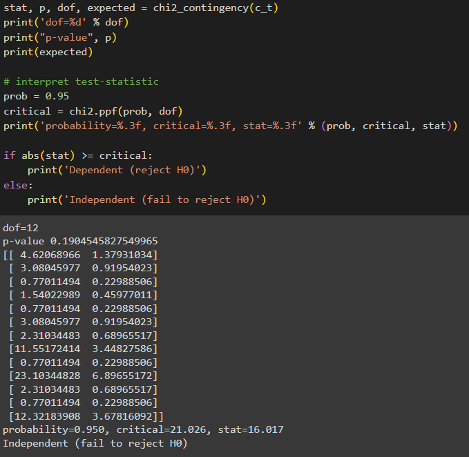
            - *Using Statistical Analysis*:- As we have rejected the H0, that there is no relationship between these two categorical variable. We can conclude that is some dependency of "education" attribute on the target variable "income".
  3. **Marital-status**:
       - Hypothesis Test:-
            - *Null Hypothesis* :- There is no relationship between Marital-status and income.
            - *Alternate Hypothesis* :- There is a relationship between Marital-status and income.
  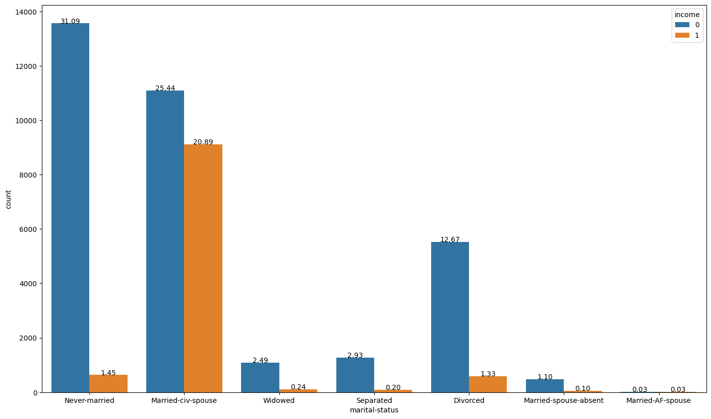
  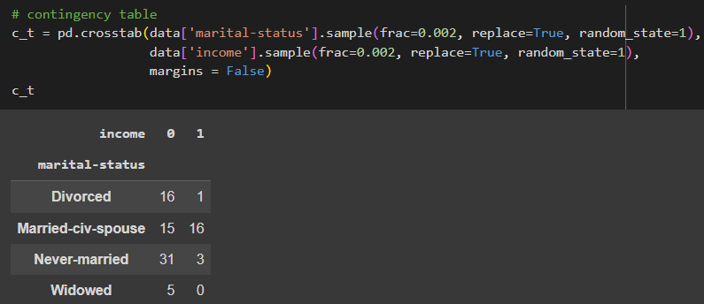
  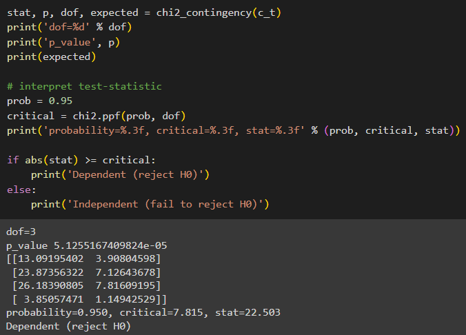
            - *Using Statistical Analysis*:- As we have rejected the H0, that there is no relationship between these two categorical variable.
We can conclude that is some dependency of "marital-status" attribute on the target variable "income"
  4. **Occupation**:
       - Hypothesis Test:-
            - *Null Hypothesis* :- There is no relationship between Occupation and income.
            - *Alternate Hypothesis* :- There is a relationship between Occupation and income.
  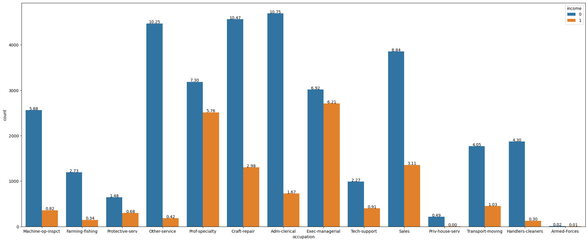
  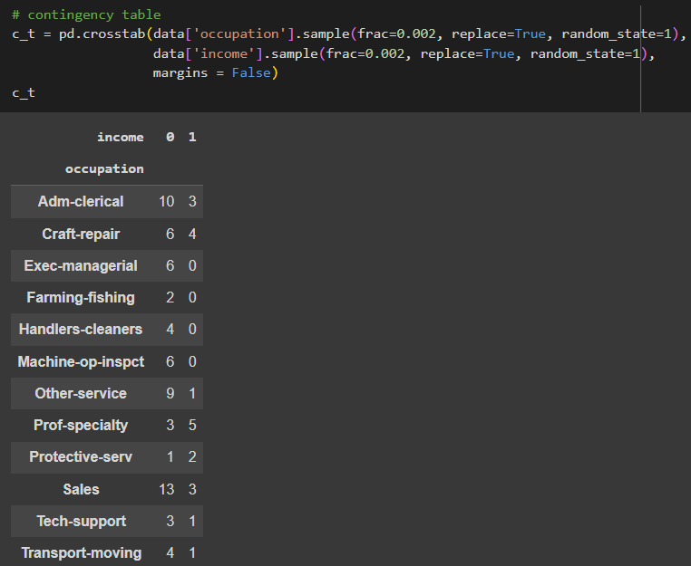
  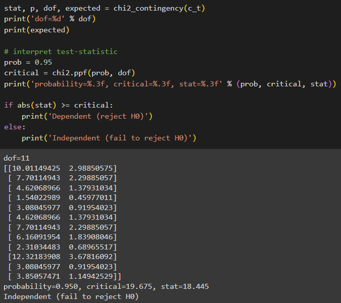
            - *Using Statistical Analysis*:- As we have rejected the H0, that there is no relationship between these two categorical variable.
We can conclude that is some dependency of "occupation" attribute on the target variable "income".
  4. **Relationship**:
       - Hypothesis Test:-
            - *Null Hypothesis* :- There is no relationship between Relationship and income.
            - *Alternate Hypothesis* :- There is a relationship between Relationship and income.
  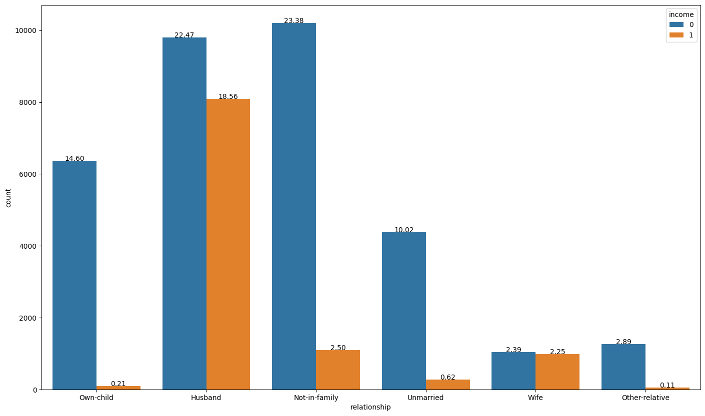
  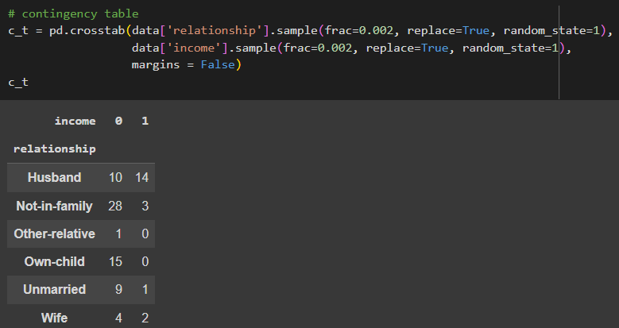
  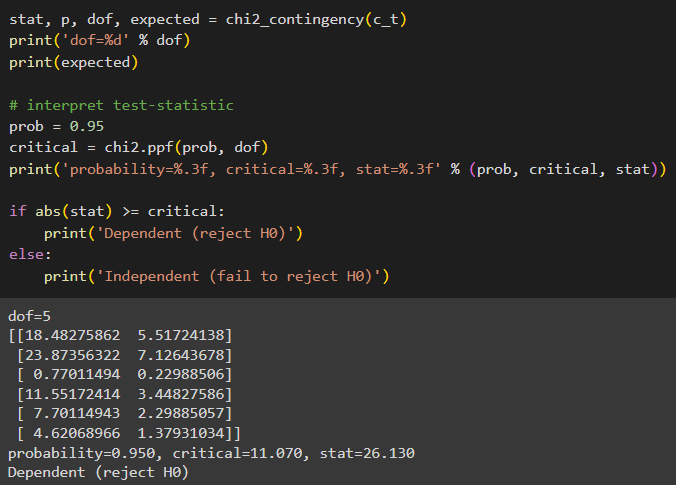
             - *Using Statistical Analysis*:- As we have rejected the H0, that there are independent to each other..
We can conclude that is some dependency of "relationship" attribute on the target variable "income".
  5. **Race**:
       - Hypothesis Test:-
            - *Null Hypothesis* :- There is no relationship between Race and income.
            - *Alternate Hypothesis* :- There is a relationship between Race and income.
  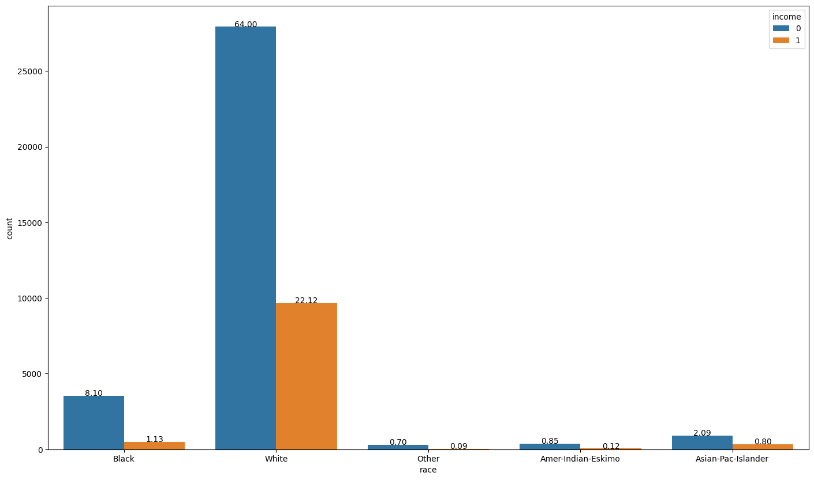
  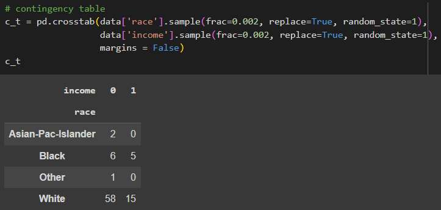
  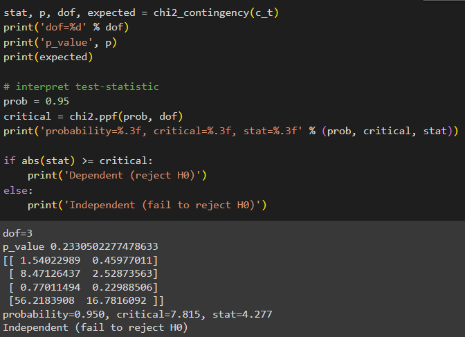
            - *Using Statistical Analysis*:- As we have accept the H0, that there is no relationship between these two categorical variable.
We can conclude that is no dependency of "race" attribute on the target variable "income".
   6. **Gender**:
        - Hypothesis Test:-
            - *Null Hypothesis* :- There is no relationship between Gender and income.
            - *Alternate Hypothesis* :- There is a relationship between Gender and income.
  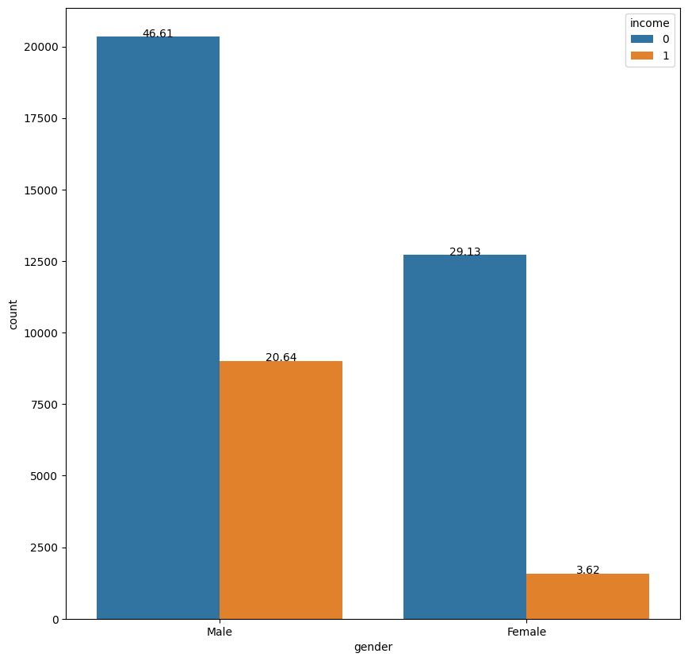
  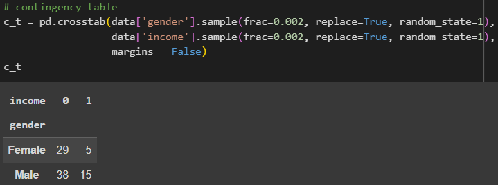
  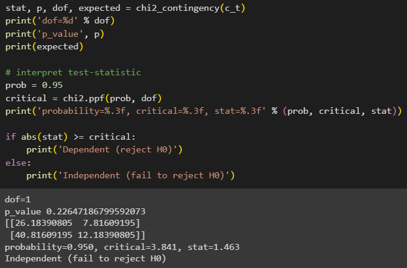
            - *Using Statistical Analysis*:- As we have rejected the H0, that there is no relationship between these two categorical variable.
We can conclude that is some dependency of "gender" attribute on the target variable "income".
   7. **Native-country**:
        - Hypothesis Test:-
            - *Null Hypothesis* :- There is no relationship between Native-country and income.
            - *Alternate Hypothesis* :- There is a relationship between Native-country and income.
  
  
  
            - *Using Statistical Analysis*:- As we have accept the H0, that there is no relationship between these two categorical variable.
We can conclude that is no dependency of "native-country" attribute on the target variable "income".

### Multivariate Analysis
   1. **Correlation among the numeric variables**:
        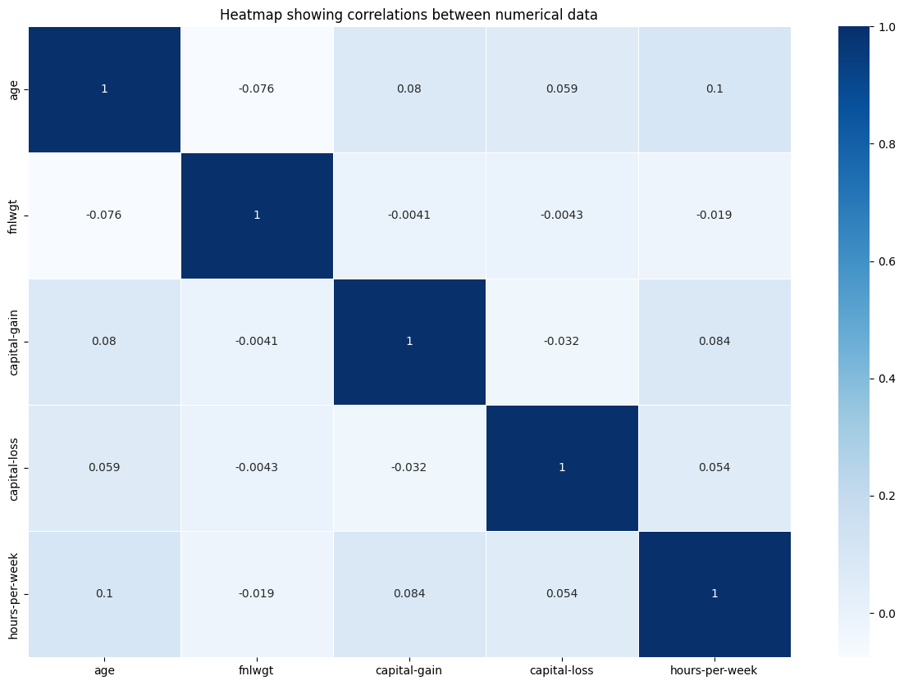
      - *Insights*:
          - There is no strong correlation among the numeric attributes.
          - There is neither strong positive nor strong negative correlation present in any variable.
          - The strongest correlation is present between capital gain and hours-per-week with Coefficient .082.(which is less than 0.1, it means that very small correlation among them).
   2. **Multivariate Analysis between "income", "hours-per-week", "gender"**:
        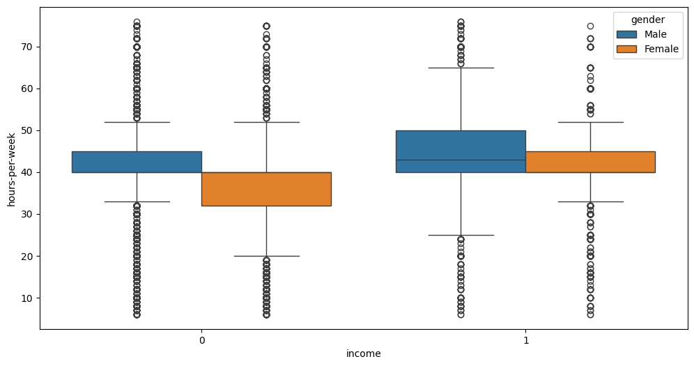
       - *Insights*:
           - The median "hours-per-week" for females is lower than the males in the Income group who earns <=50k.
           - Boxplot range for Income group who earns <=50k [minimum (q1-1.5* IQR) and maximum (q3+ 1.5* IQR)] i.e. Male ~[32,52], Female ~[17,57].
           - Boxplot range for Income group who earns >50k [minimum (q1-1.5* IQR) and maximum (q3+ 1.5* IQR)] i.e. Male ~[23,63], Female ~[30,57].
  3. **Multivariate Analysis between "income", "age", "gender"**:
       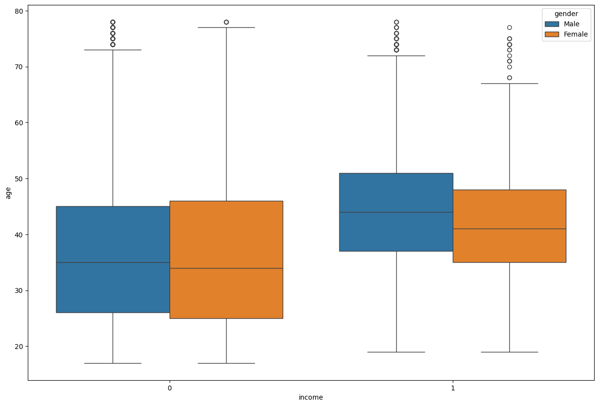
       - *Insights*:
           - Median "age" of Females who earn less than 50k has very minute difference than the Median "age" of males who earn less than 50k.
           - But the Median "age" of Females who earn greater than 50k has age difference of 2-3years than the Median "age" of males who earn greater than 50k.
   4. **Multivariate Analysis between "income", "age", "Capital-gain"**:
        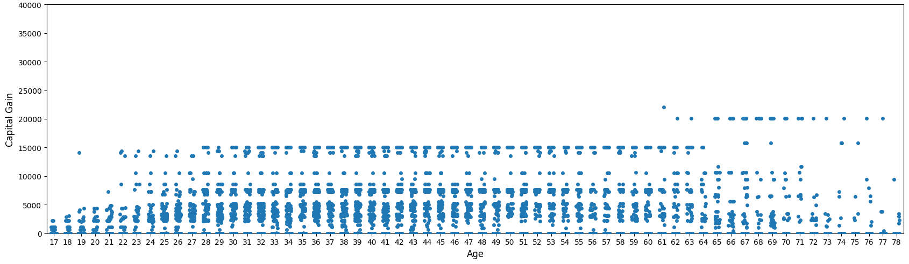
        - *Insights*:
            - Between age 28 and 64 capital gain is upto 15000 and after that it decreases and again increments at age 90.
            - Age 90 doesn't follow the pattern.
            - At age 90 people can't work in goverment or private sectors. But there are some observations present in our dataset which shows that despite the age of 90 years they work in those sectors.
  5. **Multivariate Analysis between "income", "age", "Capital-gain"**:
       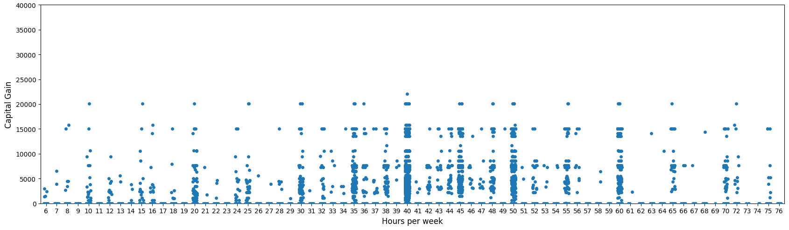
       - *Insights*:
           - Majority of people can be seen working for 40,50 and 60 hours per week and capital gain seems to be increasing.
           - There are few people working for 99 hours per week but doesn't seem to make high capital gain. Conversely people working below 40 hours per week are making high capital gains.

---
